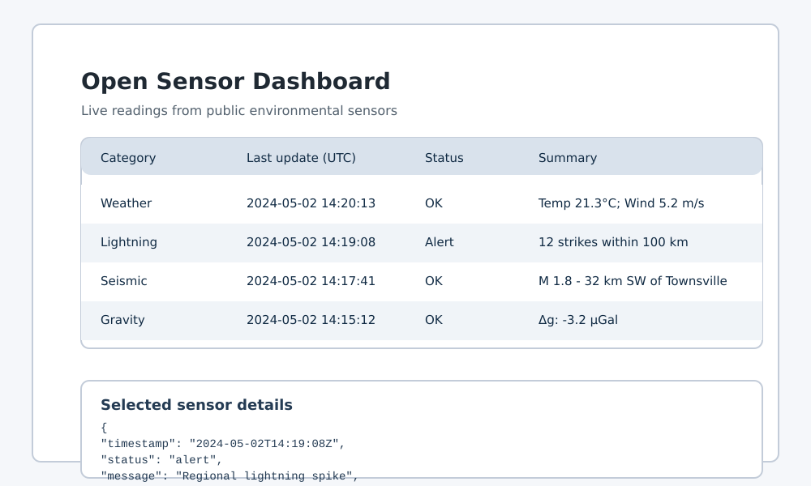

# Open Sensor Dashboard

This repository provides a desktop dashboard that aggregates readings from several publicly accessible sensor networks. The current implementation focuses on environmental and space-weather measurements, with a modular architecture that makes it easy to plug in additional sources over time.

## Supported sensors

The application currently polls the following openly accessible data services:

| Category    | Sensor implementation | Data source |
|-------------|----------------------|-------------|
| Weather (temperature, pressure, rain) | `OpenMeteoWeatherSensor` | [Open-Meteo current weather API](https://open-meteo.com/en/docs) |
| Lightning | `MetNoLightningSensor` | [MET Norway WeatherAPI Lightning endpoint](https://api.met.no/weatherapi/lightning/1.0/documentation) |
| Seismic | `USGSEarthquakeSensor` | [USGS Earthquake Hazards Program feeds](https://earthquake.usgs.gov/earthquakes/feed/v1.0/) |
| Gravity | `GravityStationSensor` | [Datahub.io global gravity station dataset](https://datahub.io/core/gravity) |
| Astronomic (solar wind) | `NOAASolarWindSensor` | [NOAA SWPC solar wind products](https://services.swpc.noaa.gov/products/) |
| Software Defined Radio (SDR) | `SatNogsObservationSensor` | [SatNOGS Network observations API](https://db.satnogs.org/api/) |

Each sensor class lives under `sensor_dashboard/sensors/` and exposes a `fetch()` coroutine that returns a normalized `SensorReading` object. Adding more sensors involves creating a new subclass and registering it in `app.py` (or a future configuration file).

## Running the dashboard

The dashboard depends only on the Python standard library. To launch it:

```bash
python app.py
```

On startup the application opens a Tkinter window that lists each sensor, its category, last update timestamp, status, and a brief summary of the current values. Selecting a sensor row reveals the structured payload in the lower pane.



The default configuration uses New York City as the reference point for location-based services (weather and lightning). Adjust `DEFAULT_LOCATION` in `sensor_dashboard/config.py` to monitor a different location, or instantiate sensors with custom coordinates in `app.build_manager()`.

## Extending the system

* **New sensors:** Implement a subclass of `sensor_dashboard.sensors.base.Sensor` and return a `SensorReading` with the desired values. Leverage the shared helpers in `sensor_dashboard.network` for HTTP requests.
* **Scheduling:** Each sensor can specify its preferred polling interval via the `update_interval` argument. The `SensorManager` enforces these intervals asynchronously.
* **Visualization:** The GUI currently renders summaries and the raw payload. For more complex visualizations consider adding matplotlib or other plotting widgets.

Future iterations can add human activity feeds, additional sensor categories, and richer alerting/visualizations without changing the core architecture established here.
